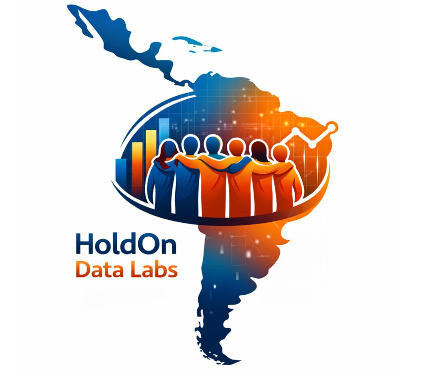

# ChurnInsight — Predicción de Cancelación de Clientes

### Soluciones Inteligentes de Retención de Clientes

**Transformando datos en estrategias de retención mediante Machine Learning**

## 📖 Presentación de la Organización

**HoldOn Data Labs** es un equipo tecnológico nacido en el **Hackathon ONE No Country 2025 (Equipo 69- Grupo 8 - Tech Advanced)**, formada por estudiantes apasionados de Data Science y desarrollo Backend. Nuestra especialidad es crear soluciones predictivas que permiten a empresas identificar clientes en riesgo de cancelación y ejecutar estrategias de retención proactivas.

### 🎯 Nuestra Misión

Desarrollar herramientas accesibles de Machine Learning que empoderen a empresas de telecomunicaciones, fintech, streaming y e-commerce para reducir churn, optimizar costos y maximizar el lifetime value de sus clientes.

### 💼 Nuestra Visión

Convertirnos en la solución referente de predicción de churn en Latinoamérica, llevando innovación tecnológica accesible a empresas de todos los tamaños.

---

## 🏆 Hackathon ONE No Country 2025

### 📅 Información Oficial del Evento

**Período de Desarrollo:** 15/12/2025 - 25/01/2026  
**Público:** Estudiantes Tech Advanced **Grupo 8** del **Programa ONE**  
**Formato:** Equipos automáticos formados por la plataforma (Data Science + Back-End Java)  
**Objetivo:** Simulación laboral real con desarrollo de MVP funcional

### 🤝 Organizadores y Aliados Oficiales

| Organización | Rol Principal |
| --- | --- |
| 🏢 **[No Country](https://www.nocountry.tech/)** | Plataforma organizadora y facilitadora |
| 🎓 **Programa ONE** | Oracle Next Education iniciativa principal del hackathon |
| 📚 **[Alura Latam](https://www.aluralatam.com/)** | Plataforma de capacitación |

## 👥 Nuestro Equipo

Equipo de **8 especialistas** distribuidos en Latinoamérica, formado automáticamente por la plataforma No Country.

### 🔙 Backend Team (Java + Spring Boot)

**Andrea Cecilia Lopez**  

**Anghelo Flores**  

**Ashley Zifrikc Villanueva Tuny**  

**Enrique Castillo**  

**Luis Fernando Jaramillo**  

### 🧠 Data Science Team (Python + ML)

**Claudia Delgado**  

**Felipe Octavio Rebolledo Robert**  

**Nicolas Ruiz**  

---

## 🙏 Agradecimientos Especiales

**No Country** - Plataforma organizadora | **Programa ONE** - Iniciativa principal | **Alura Latam** - Formación técnica

### ⭐ **ChurnInsight - Grupo 8 Tech Advanced - Equipo 69: HoldOn Data Labs**

**Hackathon ONE No Country 2025** | 

*Última actualización: Enero 2026*

